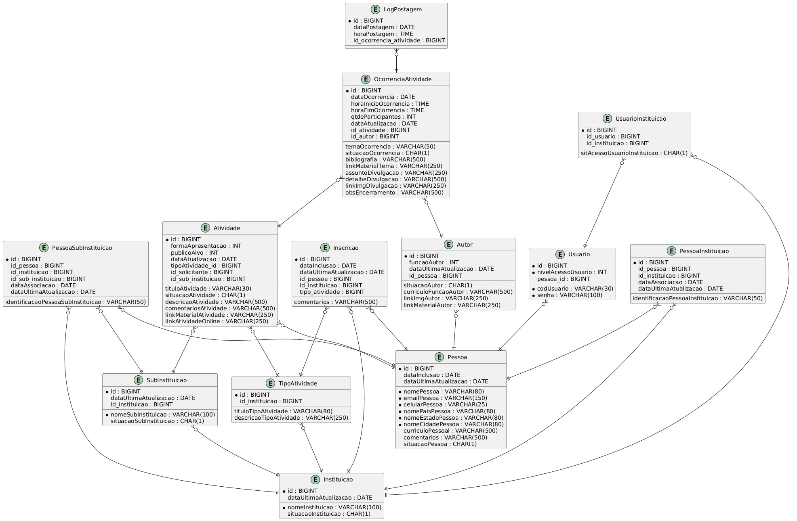

# Agenda Mais

**Agendando tudo e mais** — Sistema web para gerenciamento e inscrição de atividades por instituições.

---

## 🚀 Funcionalidades

- Login com validação de credenciais e vínculo com instituição
- Redirecionamento automático por nível de acesso:

  - Participante → `participante-form.html`
  - Autor → `autor-form.html`
  - Administrador → `administrador-form.html`
  - Superusuário → `superusuario-form.html`

- Cadastro de novo usuário com vínculo a uma ou mais instituições
- Visualização e manutenção de atividades por nível de acesso
- Interface moderna com cabeçalhos em roxo e azul, responsiva e clara

---

## 🏗️ Estrutura do Projeto

- Backend: Java + Spring Boot
- Frontend: HTML + Thymeleaf
- Banco de dados: H2 (modo arquivo)
- Estrutura de pacotes:

  - `entities`: entidades JPA
  - `repositories`: interfaces Spring Data JPA
  - `controllers`: controladores Spring MVC
  - `config`: configuração de dados iniciais (DataLoader)
  - `templates`: páginas HTML (Thymeleaf)
  - `static/css`: estilos visuais

---

## 🧪 Como Executar Localmente

### 1. Pré-requisitos

- Java 17+
- Maven 3.8+
- STS4 ou IntelliJ ou VS Code com suporte a Spring Boot

### 2. Clonar o projeto

```bash
git clone https://github.com/FranciscoCLira/agendamais.git
cd agendamais
```

### 3. Configuração

No arquivo `application.properties`:

```properties
spring.h2.console.enabled=true
spring.datasource.url=jdbc:h2:file:./data/agendadb
spring.jpa.hibernate.ddl-auto=update
spring.sql.init.mode=always
```

> Use `ddl-auto=create` para recriar o banco do zero (apaga dados), e `update` para manter o schema atual.

### 4. Rodar a aplicação

```bash
mvn clean spring-boot:run
```

### 5. Acessar o sistema

- Acesse: [http://localhost:8080/](http://localhost:8080/)
- Console do H2: [http://localhost:8080/h2-console](http://localhost:8080/h2-console)

  - URL: `jdbc:h2:file:./data/agendadb`

---

## 👥 Níveis de Acesso

```bash
----------------------------------------------------------
| Nível | Descrição     | Tela Inicial                   |
| ----- | ------------- | ------------------------------ |
| 1     | Participante  | `menu-participante-form.html`  |
| 2     | Autor         | `menu-autor-form.html`         |
| 5     | Administrador | `menu-administrador-form.html` |
| 9     | Superusuário  | `menu-superusuario-form.html`  |
----------------------------------------------------------
```

## 📦 Dados de Exemplo (via `DataLoader.java`)

- Usuário: `admin01` / Senha: `admin123` / Nível: 5
- Instituições: `INSTITUTO LUZ`, `CENTRO ALVORADA`
- Pessoas e vínculos iniciais criados automaticamente

---

## 📁 Modelo Entidade-Relacionamento (MER)

Incluído em `docs/agenda_mais_modelo_erd.png`



---

## 📚 Documentação Técnica

- **[Implementação de Locais](docs/implementa-local.md)** - Normalização completa de País/Estado/Cidade
- **[Modelo de Dados](docs/agenda_mais_modelo_erd.png)** - Diagrama Entidade-Relacionamento
- **[ERD PlantUML](docs/AgendaMais_ERD-PlantUML-V2.txt)** - Código fonte do diagrama

---

## ✅ TODO Futuro

- Implementação de inscrições por participantes
- Cadastro e edição de ocorrências
- Dashboard para superusuário

---

## 📄 Licença

Projeto desenvolvido para fins acadêmicos e institucionais. Livre para uso interno.

#

## Autor

Francisco Casemiro Lira

https://www.linkedin.com/in/franciscoclira

#

#

## Páginas web principais e IDE

##### IDE - restart app localHost


