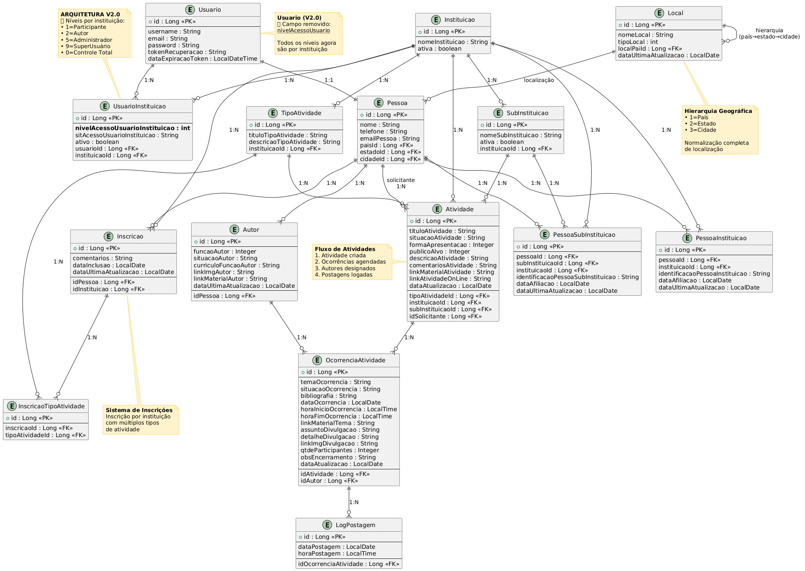
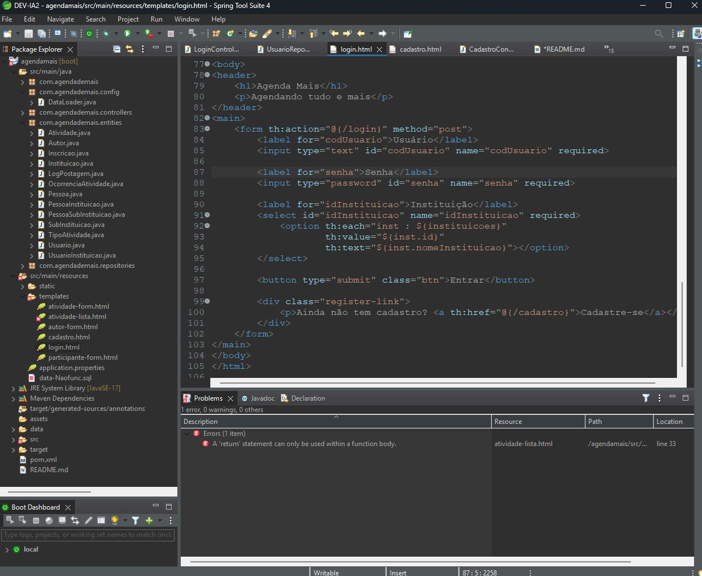

# Agenda Mais

**Agendando tudo e mais** — Sistema web para gerenciamento e inscrição de atividades por instituições.

---

## 🚀 Funcionalidades

- Login com validação de credenciais e vínculo com instituição
- Redirecionamento automático por nível de acesso:

  - Participante → `participante-form.html`
  - Autor → `autor-form.html`
  - Administrador → `administrador-form.html`
  - Superusuário → `superusuario-form.html`

- Cadastro de novo usuário com vínculo a uma ou mais instituições
- Visualização e manutenção de atividades por nível de acesso
- Interface moderna com cabeçalhos em roxo e azul, responsiva e clara

---

## 🏗️ Estrutura do Projeto

- Backend: Java + Spring Boot
- Frontend: HTML + Thymeleaf
- Banco de dados: H2 (modo arquivo)
- Estrutura de pacotes:

  - `entities`: entidades JPA
  - `repositories`: interfaces Spring Data JPA
  - `controllers`: controladores Spring MVC
  - `config`: configuração de dados iniciais (DataLoader)
  - `templates`: páginas HTML (Thymeleaf)
  - `static/css`: estilos visuais

---

## 🧪 Como Executar Localmente

### 1. Pré-requisitos

- Java 17+
- Maven 3.8+
- STS4 ou IntelliJ ou VS Code com suporte a Spring Boot

### 2. Clonar o projeto

```bash
git clone https://github.com/FranciscoCLira/agendamais.git
cd agendamais
```

### 3. Configuração

No arquivo `application.properties`:

```properties
spring.h2.console.enabled=true
spring.datasource.url=jdbc:h2:file:./data/agendadb
spring.jpa.hibernate.ddl-auto=update
spring.sql.init.mode=always
```

> Use `ddl-auto=create` para recriar o banco do zero (apaga dados), e `update` para manter o schema atual.

#### 🔄 Recriar o Banco de Dados do Zero

Para recriar o banco de dados H2 com dados iniciais (útil durante desenvolvimento):

**Windows:**
```cmd
recreate-h2-db.bat
```

**Linux/macOS:**
```bash
./recreate-h2-db.sh
```

Ver [documentação completa](docs/recreate-h2-database.md) para mais detalhes.

### 4. Rodar a aplicação

```bash
mvn clean spring-boot:run
```

### 5. Acessar o sistema

- Acesse: [http://localhost:8080/](http://localhost:8080/)
- Console do H2: [http://localhost:8080/h2-console](http://localhost:8080/h2-console)

  - URL: `jdbc:h2:file:./data/agendadb`

---

## 👥 Níveis de Acesso - **ARQUITETURA V2.0**

> **🚀 NOVA FUNCIONALIDADE**: Níveis de acesso **por instituição** (não mais globais)

```bash
------------------------------------------------------------------------
| Nível | Descrição     | Tela Inicial                   | Contexto   |
| ----- | ------------- | ------------------------------ | ---------- |
| 1     | Participante  | `menu-participante-form.html`  | Por Inst.  |
| 2     | Autor         | `menu-autor-form.html`         | Por Inst.  |
| 5     | Administrador | `menu-administrador-form.html` | Por Inst.  |
| 9     | Superusuário  | `menu-superusuario-form.html`  | Por Inst.  |
| 0     | Controle Total| `superusuario-form.html`       | Global     |
------------------------------------------------------------------------
```

### 🎯 **Casos de Uso Suportados (V2.0)**

- **Multi-institucional**: Usuário pode ser Autor na Universidade A e Administrador na Empresa B
- **Seleção de Contexto**: Login permite escolher instituição quando usuário tem múltiplos vínculos
- **Flexibilidade Total**: Diferentes responsabilidades em diferentes organizações

## 📦 Dados de Exemplo (via `DataLoader.java`) - **V2.0**

- **Usuário**: `admin01` / **Senha**: `admin123`
- **Níveis por Instituição**:
  - INSTITUTO LUZ: Nível 5 (Administrador)
  - CENTRO ALVORADA: Nível 5 (Administrador)
  - INSTITUTO CRUZ: Nível 5 (Administrador)
- **Arquitetura**: Cada usuário pode ter níveis diferentes em cada instituição
- **Login**: Sistema detecta múltiplos vínculos e permite seleção de contexto institucional

---

## 📁 Modelo Entidade-Relacionamento (MER) - **V2.0**

> **🔄 ARQUITETURA ATUALIZADA**: Migração de níveis globais para níveis por instituição

**Diagrama Atual (V2.0)**:  


### 📚 Documentação Completa V2.0:

- **[📊 Modelo ER V2.0 - Completo](docs/agenda_mais_modelo_er_v2.md)** - Documentação textual detalhada
- **[🔧 Diagrama PlantUML V2.0 - Completo](docs/AgendaMais_ERD-PlantUML-V2.txt)** - Código PlantUML com todas as entidades
- **[📈 Diagrama Mermaid V2.0 - Completo](docs/AgendaMais_ERD_V2_Mermaid_COMPLETO.md)** - Diagrama Mermaid com 15 entidades
- **[🔄 Comparativo V1→V2](docs/Migracao_Arquitetural_V1_V2_Comparativo.md)** - Análise antes/depois
- **[🛠️ Como Gerar Imagens](docs/gerar_diagramas.md)** - Instruções para gerar PNG

### 🎯 **Principais Mudanças V2.0**:

1. **Usuario.nivelAcessoUsuario** → **REMOVIDO** ❌
2. **UsuarioInstituicao.nivelAcessoUsuarioInstituicao** → **ADICIONADO** ✅
3. **Contexto Multi-institucional** → **SUPORTADO** ✅
4. **Seleção de Instituição no Login** → **IMPLEMENTADO** ✅

### 🏗️ **Entidades do Sistema Completo**:

- **Core**: Usuario, Pessoa, UsuarioInstituicao, Instituicao, Local
- **Atividades**: TipoAtividade, Atividade, Autor, OcorrenciaAtividade, LogPostagem
- **Inscrições**: Inscricao, InscricaoTipoAtividade
- **Relacionamentos**: PessoaInstituicao, PessoaSubInstituicao

---

## 📚 Documentação Técnica - **V2.0**

### 🏗️ **Arquitetura e Modelo de Dados**

- **[📊 Modelo ER V2.0 - Completo](docs/agenda_mais_modelo_er_v2.md)** - Documentação completa do modelo
- **[🔄 Migração V1→V2](docs/Migracao_Arquitetural_V1_V2_Comparativo.md)** - Análise comparativa das mudanças
- **[🔧 Diagrama PlantUML V2.0 - Completo](docs/AgendaMais_ERD-PlantUML-V2.txt)** - Código fonte do diagrama completo
- **[📈 Diagrama Mermaid V2.0](docs/AgendaMais_ERD_V2_Mermaid.md)** - Diagrama ER moderno

### 🚀 **Funcionalidades e Implementação**

- **[Implementação de Locais](docs/implementa-local.md)** - Normalização completa de País/Estado/Cidade
- **[Estrutura de Níveis V2.0](docs/estrutura-niveis-usuario.md)** - Sistema de permissões por instituição
- **[Atualização do Diagrama ER](docs/atualizacao-diagrama-local.md)** - Mudanças no modelo de dados

### 🛠️ **Ferramentas e Manutenção**

- **[Backup e Restore](backup-tools/README-backup-tools.md)** - Ferramentas de backup e restore
- **[Como Gerar Diagramas](docs/gerar_diagramas.md)** - Instruções para gerar PNG dos diagramas

---

## � Envio de E-mail por Instituição (SMTP dinâmico)

O sistema agora suporta envio usando credenciais SMTP por instituição. Principais pontos:

- Campos adicionados na entidade `Instituicao` (através de migration Flyway):
  - `smtp_host`, `smtp_port`, `smtp_username`, `smtp_password`, `smtp_ssl`
- Para habilitar o uso do SMTP por instituição, defina no ambiente:

```
APP_MAIL_USEINSTITUTIONSMTP=true
```

- As senhas são cifradas usando Jasypt com uma chave mestra definida na variável de ambiente `JASYPT_MASTER_KEY` (ou `MASTER_KEY`).

Exemplo `.env`:

```
APP_MAIL_USEINSTITUTIONSMTP=true
JASYPT_MASTER_KEY=uma_chave_muito_forte
```

- Administração: existe uma tela administrativa (GET `/admin/instituicao/smtp/{id}`) para editar as configurações SMTP de cada instituição e testar a conexão.

Segurança e recomendações:

- Não armazene senhas em texto claro em produção.
- Use uma chave mestra forte e proteja seu ambiente.
- Em produção, considere usar um secret manager (Vault, KeyVault) e reduzir o alcance do acesso.

## �📖 Documentação

- **[Estrutura de Níveis de Usuário](docs/estrutura-niveis-usuario.md)** - Definições completas dos níveis de acesso e funcionalidades
- **[Implementação da Entidade Local](docs/implementa-local.md)** - Documentação da normalização de locais
- **[ERD - Diagrama de Entidades](docs/AgendaMais_ERD-PlantUML-V2.txt)** - Modelo de dados em PlantUML
- **[Backup e Restore](backup-tools/README-backup-tools.md)** - Ferramentas de backup e restore
- **[Recriar Banco de Dados H2](docs/recreate-h2-database.md)** - Como recriar o banco de dados do zero para desenvolvimento

---

## ✅ TODO Futuro

- Implementação de inscrições por participantes
- Cadastro e edição de ocorrências
- Dashboard para superusuário

---

## 📄 Licença

Projeto desenvolvido para fins acadêmicos e institucionais. Livre para uso interno.

#

## Autor

Francisco Casemiro Lira

https://www.linkedin.com/in/franciscoclira

#

#

## Páginas web principais e IDE

##### IDE - restart app localHost


