```mermaid
erDiagram
    %% AgendaMais - Modelo ER V2.0
    %% Pós-refatoração: Níveis de acesso por instituição

    %% ================================================
    %% ENTIDADES PRINCIPAIS
    %% ================================================

    USUARIO {
        bigint id PK "Auto-increment"
        varchar username UK "4-25 chars, unique"
        varchar password "Min 6 chars, pattern"
        varchar situacaoUsuario "A=Ativo, B=Bloqueado"
        date dataUltimaAtualizacao
        varchar tokenRecuperacao "36 chars, nullable"
        timestamp dataExpiracaoToken "nullable"
        bigint pessoa_id FK "NOT NULL, 1:1"
    }

    USUARIO_INSTITUICAO {
        bigint id PK "Auto-increment"
        varchar sitAcessoUsuarioInstituicao "A=Ativo, B=Bloqueado, C=Cancelado"
        int nivelAcessoUsuarioInstituicao "1=Participante, 2=Autor, 5=Admin, 9=Super"
        bigint usuario_id FK "NOT NULL"
        bigint instituicao_id FK "NOT NULL"
    }

    PESSOA {
        bigint id PK "Auto-increment"
        varchar nomePessoa
        varchar emailPessoa UK "NOT NULL, unique"
        varchar celularPessoa
        varchar situacaoPessoa "A=Ativo, B=Bloqueado, C=Cancelado"
        text comentarios "nullable"
        text curriculoPessoal "nullable"
        date dataInclusao
        date dataUltimaAtualizacao
        bigint id_pais FK "Referência Local tipo=1"
        bigint id_estado FK "Referência Local tipo=2"
        bigint id_cidade FK "Referência Local tipo=3"
    }

    INSTITUICAO {
        bigint id PK "Auto-increment"
        varchar nomeInstituicao
        varchar situacaoInstituicao "A=Ativo, B=Bloqueado"
        date dataUltimaAtualizacao
    }

    SUB_INSTITUICAO {
        bigint id PK "Auto-increment"
        varchar nomeSubInstituicao
        varchar situacaoSubInstituicao "A=Ativo, B=Bloqueado"
        date dataUltimaAtualizacao
        bigint instituicao_id FK "NOT NULL"
    }

    %% ================================================
    %% LOCALIZAÇÃO NORMALIZADA
    %% ================================================

    LOCAL {
        bigint id PK "Auto-increment"
        int tipoLocal "1=País, 2=Estado, 3=Cidade"
        varchar nomeLocal
        varchar revisadoLocal "s/n, default=n"
        date dataUltimaAtualizacao
        bigint id_pai FK "Auto-referencial, nullable"
    }

    %% ================================================
    %% RELACIONAMENTOS PESSOA-INSTITUIÇÃO
    %% ================================================

    PESSOA_INSTITUICAO {
        bigint id PK "Auto-increment"
        varchar identificacaoPessoaInstituicao "20 chars max"
        date dataAfiliacao
        date dataUltimaAtualizacao
        bigint pessoa_id FK "NOT NULL"
        bigint instituicao_id FK "NOT NULL"
    }

    PESSOA_SUB_INSTITUICAO {
        bigint id PK "Auto-increment"
        varchar identificacaoPessoaSubInstituicao "20 chars max"
        date dataAfiliacao
        date dataUltimaAtualizacao
        bigint pessoa_id FK "NOT NULL"
        bigint instituicao_id FK "NOT NULL"
        bigint sub_instituicao_id FK "NOT NULL"
    }

    %% ================================================
    %% ATIVIDADES E INSCRIÇÕES
    %% ================================================

    TIPO_ATIVIDADE {
        bigint id PK "Auto-increment"
        varchar tituloTipoAtividade
        text descricaoTipoAtividade
        bigint instituicao_id FK "NOT NULL"
    }

    INSCRICAO {
        bigint id PK "Auto-increment"
        text comentarios "nullable"
        date dataInclusao
        date dataUltimaAtualizacao
        bigint id_pessoa FK "NOT NULL"
        bigint id_instituicao FK "NOT NULL"
    }

    INSCRICAO_TIPO_ATIVIDADE {
        bigint id PK "Auto-increment"
        bigint inscricao_id FK "NOT NULL"
        bigint tipo_atividade_id FK "NOT NULL"
    }

    %% ================================================
    %% RELACIONAMENTOS PRINCIPAIS
    %% ================================================

    %% Relacionamento 1:1 obrigatório Usuario-Pessoa
    USUARIO ||--|| PESSOA : "1:1 obrigatório"

    %% NOVA ARQUITETURA: Níveis de acesso por instituição
    USUARIO ||--o{ USUARIO_INSTITUICAO : "1:N níveis por instituição"
    INSTITUICAO ||--o{ USUARIO_INSTITUICAO : "1:N usuários"

    %% Hierarquia institucional
    INSTITUICAO ||--o{ SUB_INSTITUICAO : "1:N subdivisões"

    %% Localização normalizada (hierárquica)
    LOCAL ||--o{ LOCAL : "1:N hierarquia geográfica"
    LOCAL ||--o{ PESSOA : "1:N país"
    LOCAL ||--o{ PESSOA : "1:N estado"
    LOCAL ||--o{ PESSOA : "1:N cidade"

    %% Relacionamentos Pessoa-Instituição
    PESSOA ||--o{ PESSOA_INSTITUICAO : "1:N afiliações"
    INSTITUICAO ||--o{ PESSOA_INSTITUICAO : "1:N membros"

    PESSOA ||--o{ PESSOA_SUB_INSTITUICAO : "1:N sub-afiliações"
    INSTITUICAO ||--o{ PESSOA_SUB_INSTITUICAO : "1:N"
    SUB_INSTITUICAO ||--o{ PESSOA_SUB_INSTITUICAO : "1:N membros"

    %% Atividades por instituição
    INSTITUICAO ||--o{ TIPO_ATIVIDADE : "1:N atividades"

    %% Sistema de inscrições
    PESSOA ||--o{ INSCRICAO : "1:N inscrições"
    INSTITUICAO ||--o{ INSCRICAO : "1:N"
    INSCRICAO ||--o{ INSCRICAO_TIPO_ATIVIDADE : "1:N tipos"
    TIPO_ATIVIDADE ||--o{ INSCRICAO_TIPO_ATIVIDADE : "1:N inscrições"
```

## Principais Mudanças V2.0

### 🔴 REMOVIDO

- `USUARIO.nivelAcessoUsuario` → Era um nível global por usuário

### 🟢 ADICIONADO

- `USUARIO_INSTITUICAO.nivelAcessoUsuarioInstituicao` → Níveis específicos por instituição
- Flexibilidade total: um usuário pode ter diferentes níveis em diferentes instituições

### 📊 Níveis de Acesso Suportados

- **1** = Participante (acesso básico)
- **2** = Autor (criação de conteúdo)
- **5** = Administrador (gestão institucional)
- **9** = SuperUsuário (acesso total + Controle Total global)
- **0** = Controle Total (contexto especial para SuperUsuários)

### 🔄 Fluxo de Autenticação

1. Login com username/password
2. Sistema consulta `USUARIO_INSTITUICAO` para instituições ativas
3. Se múltiplas: exibe seleção de instituição
4. Se SuperUsuário: oferece "Controle Total" + instituições
5. Sessão armazena: `usuarioLogado`, `instituicaoSelecionada`, `nivelAcessoAtual`

### 🎯 Benefícios da Nova Arquitetura

- **Flexibilidade**: Diferentes níveis por instituição
- **Escalabilidade**: Suporte a múltiplas organizações
- **Segurança**: Controle granular de permissões
- **UX**: Contexto institucional dinâmico
